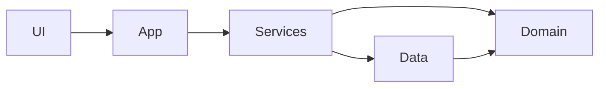
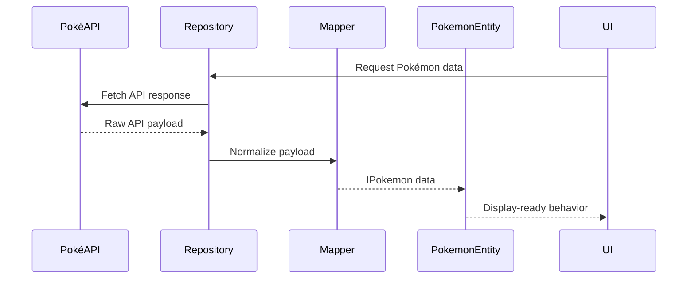

# Architecture

Pokédex React uses a layered structure that keeps API details and UI concerns separate from domain behavior.

## Layers

| Layer    | Location        | Responsibility                                                   |
| -------- | --------------- | ---------------------------------------------------------------- |
| App      | `src/app/`      | Application-level hooks, configuration, and composition          |
| UI       | `src/ui/`       | React components, presentation, and user interaction             |
| Services | `src/services/` | Application workflows that coordinate domain and data operations |
| Data     | `src/data/`     | API clients, repositories, and mapping external responses        |
| Domain   | `src/domain/`   | DTOs, entities, types, builders, and pure business rules         |
| Utils    | `src/utils/`    | Shared technical utilities that do not belong to a domain        |

## Dependency Direction

The preferred dependency direction is:

The domain layer should not import from UI, app, services, or data. The data layer may depend on domain contracts and maps external API responses into those contracts. Services coordinate use cases without moving API parsing or presentation formatting into components.

## Data Flow

## Boundary Rules

- Keep raw API response types and normalization logic in the data layer.
- Keep display and business rules that belong to Pokémon in domain entities or pure domain helpers.
- Keep React state, event handlers, and rendering in the UI/app layers.
- Do not make domain code depend on browser globals or network clients.
- Prefer importing the domain public API from `src/domain/models/index.ts` outside the domain models directory.
- Own repository and use-case contracts in `src/domain/contracts/` so data implementations depend on the domain, not the other way around.
- Add tests at the layer that owns the behavior: pure tests for helpers, entity tests for domain behavior, and integration tests for data/service workflows.

## Adding a Feature

1. Identify whether the behavior is domain, data, service, or UI logic.
2. Add or update the domain contract if external data is exposed to the application.
3. Map external data before it reaches services or UI code.
4. Keep the UI focused on rendering and interaction.
5. Add focused tests and run the checks documented in `CONTRIBUTING.md`.
